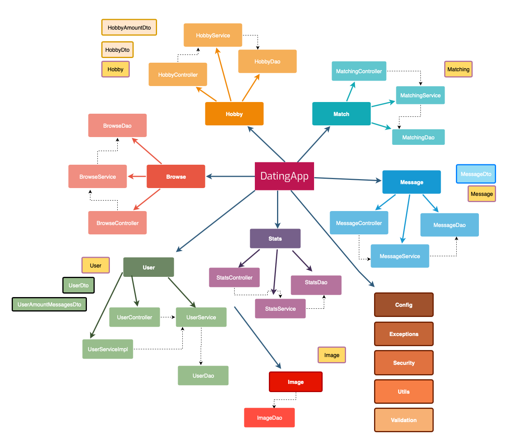
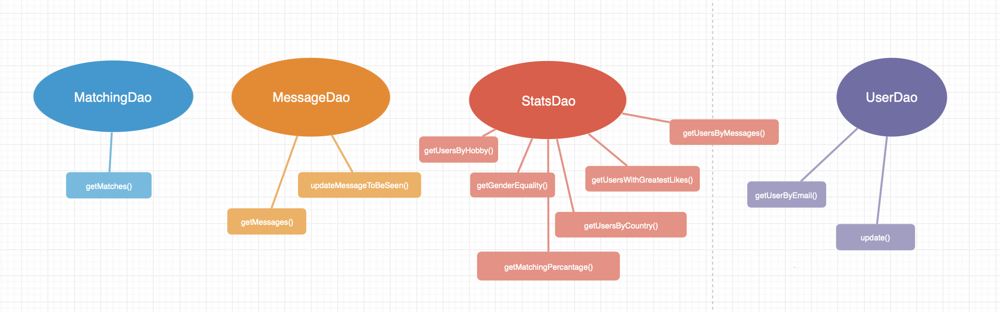
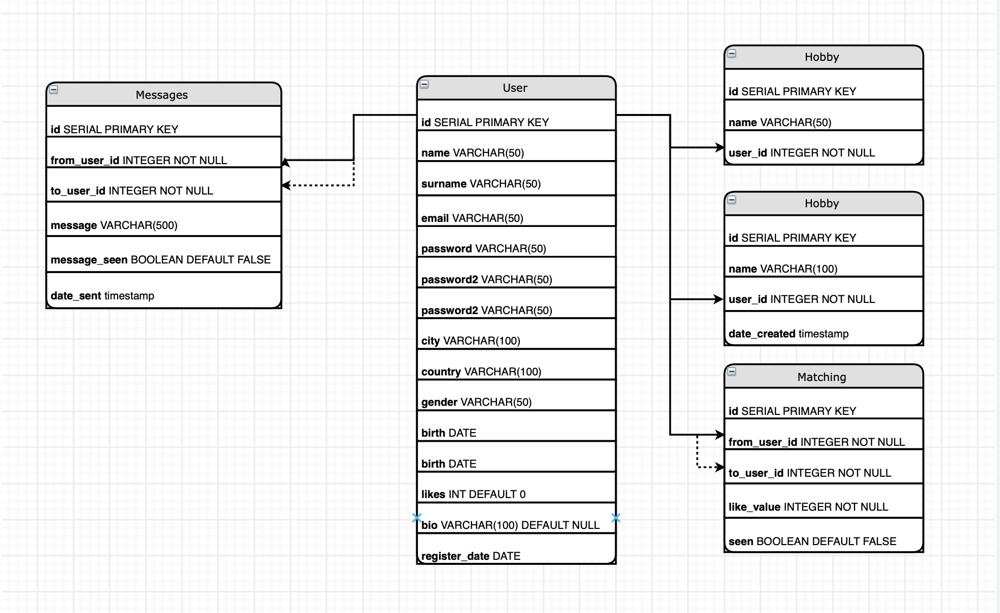

# matching.app.draft
マッチングアプリの構想です。

コミュニケーションプラットフォームを主な焦点とするアプリケーションです。ユーザーは、地域、好み、趣味に基づいて、新しい物件を手軽に探します。アプリケーションは、個人プロフィールページ、統計の概要、オープンチャットの場でもある。

## App Source
- https://github.com/angrun/tinder
- Backend: https://github.com/angrun/app-backend
- Frontend: https://github.com/mariiv2/datingApp-frontend

## Built With
- Java SE 11
- Spring Framework
- PostgreSQL open-source relational database
- Vue.js open-source JavaScript framework
- JavaScript charting for designers & developers chart.js
- Bootstrap free open-source CSS framework

## Tools used for better development proccess
- Java integrated development environment VSCode
- Swagger open-source software framework for managing RESTful Web services

## Diagrams
図1：基本的なアプリケーションフロー図

図2：基本的なアプリケーションインフラストラクチャ

図3：アプリケーションDaoの基本的なタスク

図4：主なエンティティとその関係

